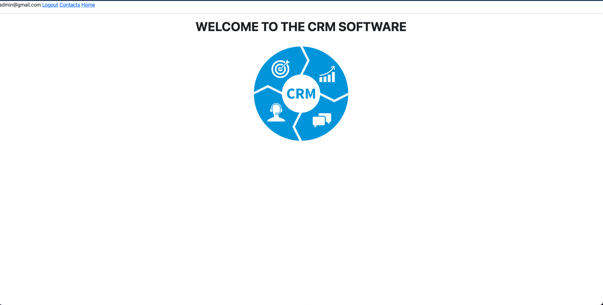
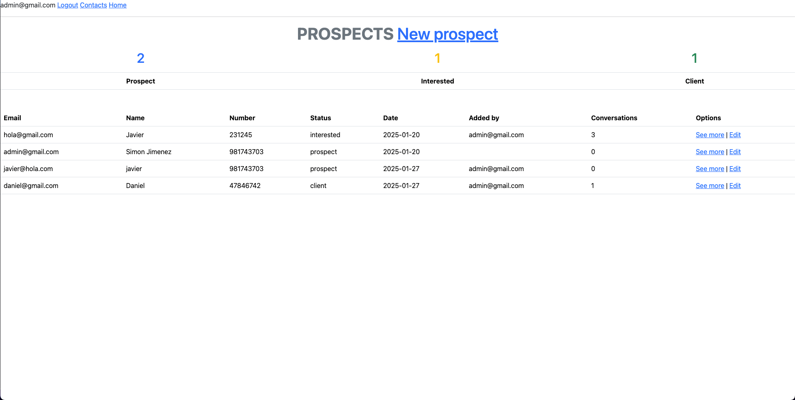
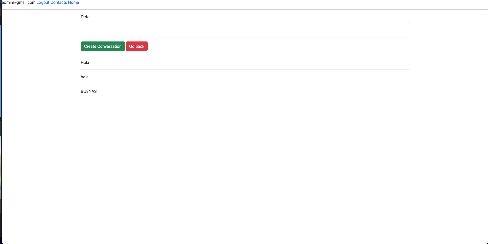

# README

This README would normally document whatever steps are necessary to get the
application up and running.

Things you may want to cover:

* Ruby version :3.1.2

* System dependencies
  bundle install

* Database creation
  rails db:create

* Database initialization
  rails db:migrate

* Seed
  rails db:seed

* Captures
  
  
  
